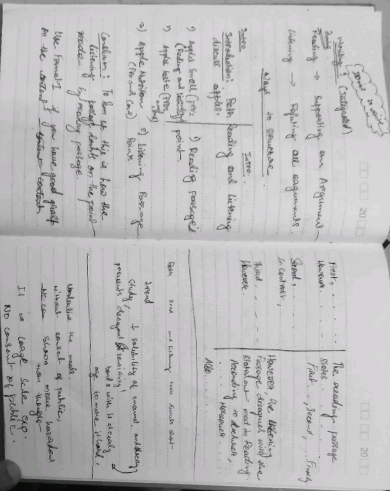
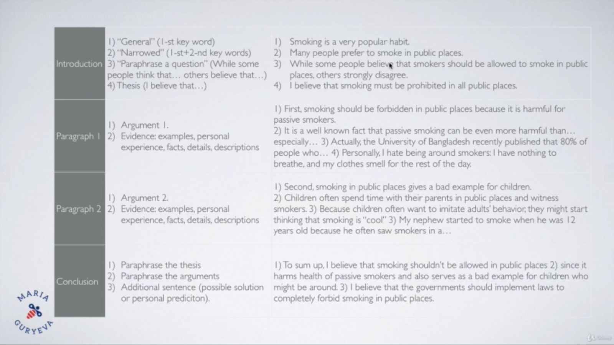
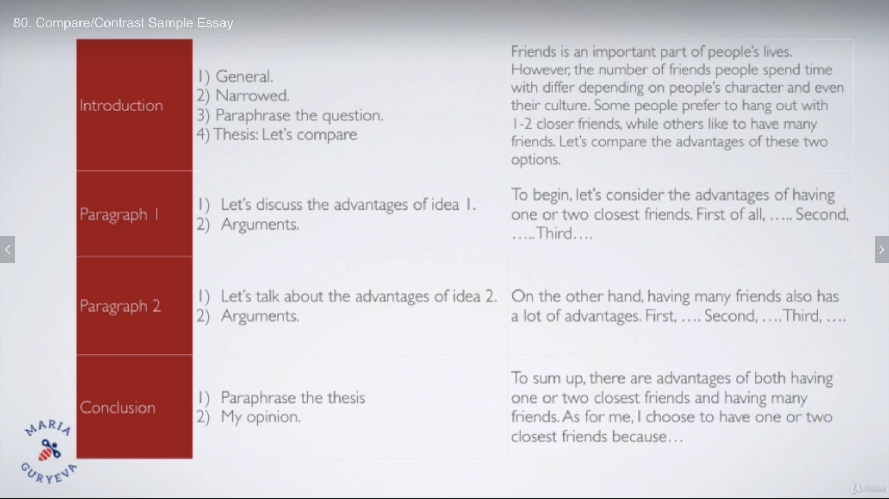

---
TOEFL NOTES
-
---

#READING
####Words in context
 Which is the best synonym in that context.
 
####Fact and Details
 (Most common Question) - Ask some details from the passage.
 
####Inference
 Need to make some conclusions about what is not written in the passage.
 
#### Referent 
 This is where we have pronoun. We have to figure out which word can be replaced by this pronoun.
 It is not the most popular type of question. It is easy. Mostly you get only 2-3  questions like this.
 
#### Words in place
#####Hacks
- pay attention to transition of the sentences.
 
#### Summary
 Partial points available. Questions worth maximum points.
 
 Given a thesis you have to figure out sentences which support this thesis.
 ##### Types of Summary questions
 - 2 Points question
 
 - 4 points question
 
---
#LISTENING
NA

---
#SPEAKING
You have 6 speaking questions to answer.
Q1 & Q2 are independent tasks. Q4-Q5 are integrated speaking tasks.

#### Speaking task 1
No reading and listening, Only speaking.
Prep time - 15 secs.
Task time - 45 secs.

It is an independent task. You are given with an question and you have to speak on it for 45 secs.

#####Sample question
> "Describe changes in technology that have affected your life, also which effect they had on you as a student. Include details and example to support your explanation"

##### Answer Format
- Introduction - Rephrase the question and say your opinion. *(5secs)*
    > if you ask me about _______ , I would choose __________.
- Argument 1. Detail and Examples to support it. *(25 secs)*
    > First, ____
- Argument 2. Detail and Examples to support it. *(40 secs)*
    > Second, _____
- Conclusion. *(45 secs)*
    > To sum up, that's why I believe that ________.
    
 Details and Example are least important in this task. 
 
 
#### Speaking task 2
- No reading and listening, Only speaking.
  - Prep time - 15 secs.
  - Task time - 45 secs.
 
 It is an independent task. You are given with an question and you have to speak on it for 45 secs.
Compared to task 1, It has only 2 options(Do you disagree type of question).
 Always choose the option which is easy to describe and not the truth.
 
#####Sample question
 > "What kind of friend is better, one who is very similar to you or one who is totally different. What kind of friends do you prefer and why. Include details and example to support your explanation."
 
##### Answer Format
 - Introduction (5secs) - Rephrase the question and say your opinion.
     > Though some people believe that _____, others believe that ____ . I believe that _____.
 - Argument 1. Detail and Examples to support it.(25 secs)
     > First, _____
 - Argument 2. Detail and Examples to support it.(40 secs)
     > Second, _____
 - Conclusion.(45 secs)
     > To sum up, that's why I believe that ________.
     
Details and Example are least important in this task.

#### Speaking task 3
- All 3 reading, listening and speaking.
   - Reading - **45 secs**.
   - Listening - **2-3 minutes**.
   - Prep time - **30 secs**.
   - Task time - Summarize the announcement and discussions - **60 secs**.
- Reading - It is always about an announcement in the campus.
  - Very important to note **what, when and where**.
- Listening - We hear 2 students having dialect about this announcement.
  - Always a man and woman is going to speak. Write notes in zig zag fashion.
- Taking notes is very crucial in this task.
 
 
It is an integrated task. You have to summarize the announcement and discussion b/w the 2 students in 60 secs.
 
#####Sample question
[Embedded pdf]()
[Embedded audio]() 
 
##### Answer Format
 - Introduction
     > There is an announcement on campus about *what*, that will happen on *when* at *where* organized by *whom*. Some features maybe.....
 - Next part
    > Two students discuss about the announcement.
    > The man says/asks....
    > The woman says/asks...

#### Speaking task 4
- All 3 reading, listening and speaking.
   - Reading - **45 secs**.
   - Listening - **2-3 minutes**.
   - Prep time - **30 secs**.
   - Task time - Summarize the text and the lecture - **60 secs**.
- Reading - A paragraph from a text book.
- Listening - Professor comments about the text.
- Taking notes is very crucial in this task.
 
 
It is an integrated task. You have to summarize the text and lecturer's comments within 60 secs.
 
#####Sample question
[Embedded pdf]()
[Embedded audio]() 
 
##### Answer Format
 - Introduction
     > The reading passage discusses ....
 - Next part
    > The lecturer says ...
    
    
#### Speaking task 5
- No reading. Only listening and speaking.
   - Listening - **2-3 minutes**.
   - Prep time - **20 secs**.
   - Task time - Summarize the announcement and discussions - **60 secs**.
- Listening - We hear 2 students discussing a problem and how to solve them.
  - Always a man and woman is going to speak. Write notes in zig zag fashion.
- Taking notes is very crucial in this task.
- Another very important thing about this task is you have to come up with your own opinion about which view you like the most and why.
 
 
It is an integrated task. 
 
#####Sample question
[Embedded audio]() 
 
##### Answer Format
 - Introduction
     > Two students discuss the problem of _______. The man says _____, The woman says ______.*(in same flow in which dialect happened)*
 - Next part
    > As for me I would do/choose ___, because ___.
    
#### Speaking task 6
- No reading. Only listening and speaking.
   - Listening - **2-3 minutes**.
   - Prep time - **20 secs**.
   - Task time - Summarize the academic lecture - **60 secs**.
- Listening - You are going to hear an academic lecture.
- Taking notes is very crucial in this task.
- In contrast to Task 5, here you do not give your opinion.
- Highlighting the key info is important here.
 
 
It is an integrated task. 
 
#####Sample question
[Embedded audio]() 
 
##### Answer Format
 - Introduction
     > The lecture discusses .......
    
#WRITING
Writing cohesive essays is very important.

#### Writing task 1
- Read, listen and then write an essay. It is an integrated task.
   - Reading - **3 minutes**.
   - Listening - **2 minutes**
   - Task time - Summarize the announcement and discussions - **20 minutes** - **150-225words**
- Listening - The lecturer contradicts everything written in the passage.
- Taking notes is very crucial in this task.
- Paraphrase everything from the text.
 
 
It is an integrated task. You are given a passage. Then you listen a lecture which contradicts everything in the passage.
 
#####Sample question
[Embedded pdf]()
[Embedded audio]() 
 
##### Answer Format

#### Writing task 2
-  write an essay. It is an independent task.
   - Task time - Write an essay on the given topic - **20 minutes** - **150-225words**
- Three types of writing topics
  - Do you agree/disagree
  - Descriptive
  - Compare/Contrast two things.
- Descriptive & Agree/Disagree are the same.
 
#####Do you agree/disagree Example

#####Descriptive

#####Compare/Contrast

 
##### Answer Format
